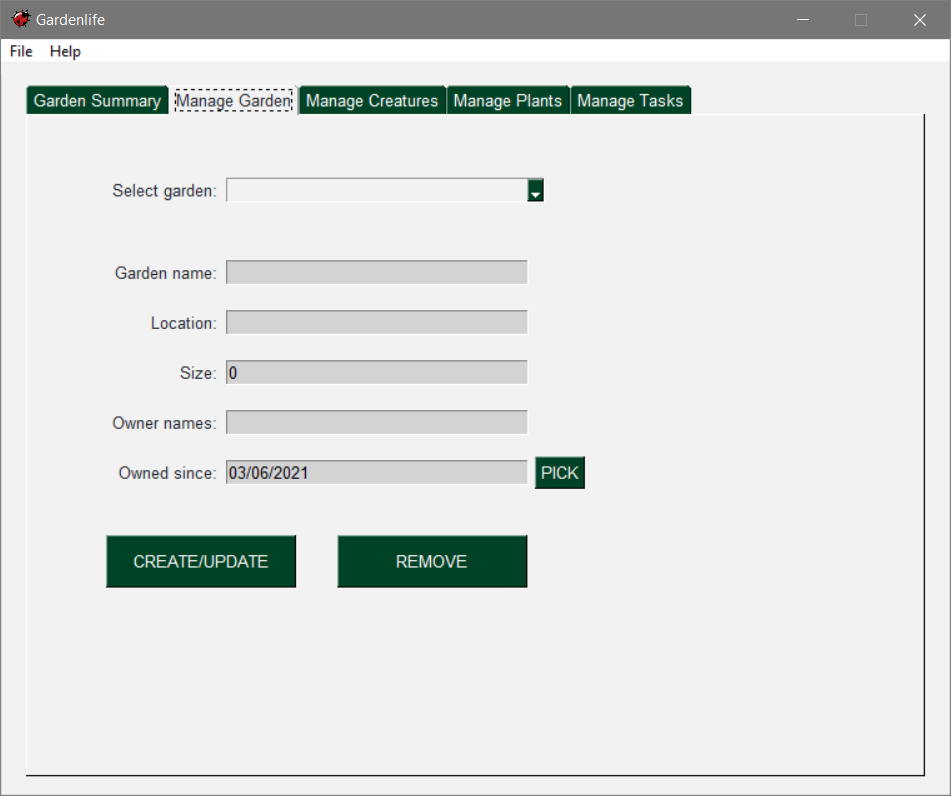
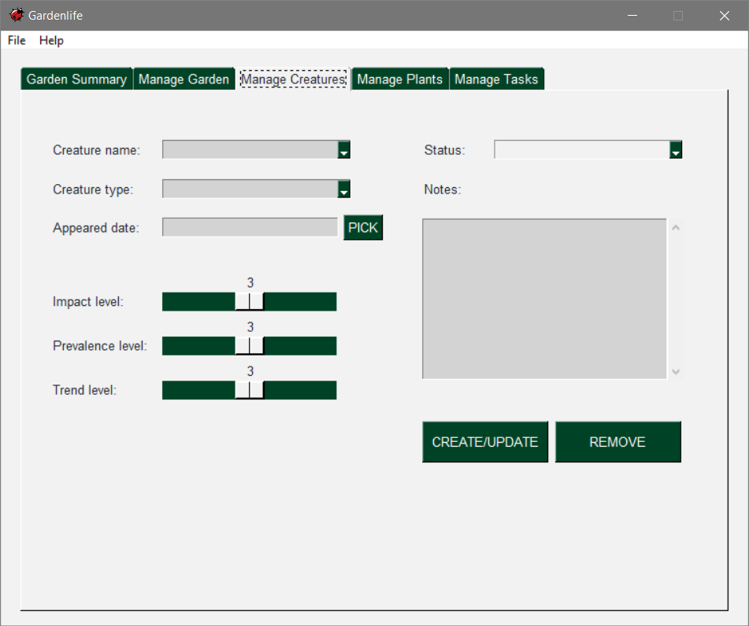
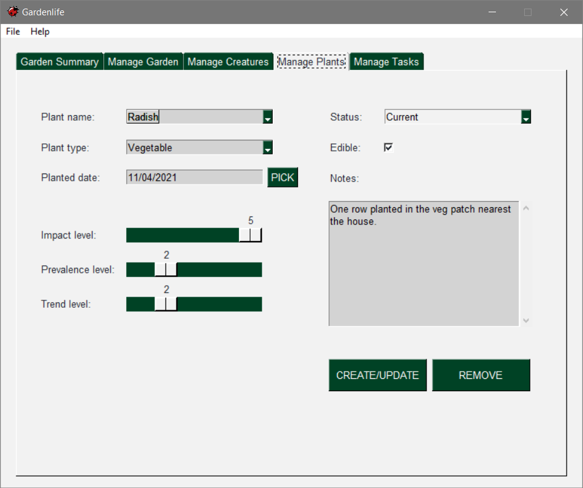

.. figure:: docs/gardenlife_logo.png
  :alt: Gardenlife logo. A stylised red ladybug with the text gardenlife.

|

A garden management application.

Gardenlife helps you keep track of all the creatures and plants in your garden (or gardens).
You can also use it to schedule one-off/repeat tasks and record progress.

Usage
~~~~~

Gardenlife is a desktop application written in Python that can be run via an executable file. 
It isn’t necessary to install a Python interpreter or any modules.

A version compatible with Windows 10 can be downloaded by clicking `gardenlife`_.
Simply unzip the folder, place it in your chosen location, and double click the .exe file.

Demo
~~~~

Here is a demo of gardenlife being used to add and remove creature and plant details.
It also shows how to update task progress and view summary reports.

Detailed Instructions
~~~~~~~~~~~~~~~~~~~~~

Gardenlife is structured into five different tabs. The *Garden Summary* tab contains information about the currently selected garden. The *Manage Garden* tab allows you to choose a garden and create a new one. Once a garden is selected, you can update its details or remove it. The other three tabs are used to manage the creatures, plants, and tasks associated with the current garden.

The following sections explain how to get started and describe each tab in more detail.

Manage Garden
*************

The first time you fire up gardenlife, most of its fields will be completely blank. To get going, you need to create your garden by navigating to the *Manage Garden* tab and entering its name, location, and a few other details. The size should be given in acres, and owner names must be separated by a single space. You can select the owned since date from a calendar by clicking the *PICK* button.

When you’ve added the info, you need to hit the *CREATE/UPDATE* button. This will clear all the fields, but when you select your garden from the dropdown list near the top of the tab, they will reappear.

If you want to keep track of more than one garden, you can add as many as you like in the same way. You can also remove the currently selected garden by clicking the *REMOVE* button.

Garden Summary
**************
Now that your garden has been added, you can view a summary of its details on the *Garden Summary* tab.

As you can see, the information entered on the *Manage Garden* tab has been used to populate the relevant fields. There are several totals towards the bottom of the tab, all initially set to zero. These numbers automatically grow as you begin to add creatures, plants, and tasks to your garden. The outstanding tasks total will show any tasks you have added that are due, overdue, or very overdue (you can read more about this in the *Manage Tasks* section below).

Right at the bottom, there is a field that displays the current season.

Manage Creatures
****************

The *Manage Creatures* tab lets you create, update, and remove creatures from the selected garden.

To create your first creature, you need to add its name and type to the relevant fields and fill in any other details that you want to record. You can use the *PICK* button to select the date the creature first appeared. You can also set the impact, prevalence, and trend levels for the creature using the provided sliders. 

Impact levels range from 1 (very negative) to 5 (very positive) and allow you to record how you feel the creature affects the garden. So, you might consider bees very positive because they pollinate your plants, but too many slugs as negative because they keep eating your vegetables! 

The prevalence slider can be used to indicate how common the creature is in your garden, ranging from very low (if there’s only one or two) to very high (if you see them all the time).

Lastly, the trend level lets you record whether sightings of the creature seem to be increasing, decreasing, or staying stable.

As with some of gardenlife’s other fields, if you hover your mouse over the sliders, tips about using them will appear.

The notes field can be used to record more detailed information, like the exact number of a particular creature in your garden, when you last saw one, or how it’s currently behaving.

Once you’ve inserted the creature’s details, you need to click the *CREATE/UPDATE* button to add it to your garden.

Most of the fields on this tab (and those on the plants and tasks tabs) are optional, so there’s no need to complete them if you don’t feel it’s necessary. If a field is required, or the information you add to it needs to be in a specific format, a window will pop up to make you aware of any problems. You can see an example below:

If you want to view, update, or remove an existing creature, you just need to select it by clicking the arrow next to the creature name field.

Any changes you make must be added by clicking the *CREATE/UPDATE* button, or they will be lost when you select a different creature (or garden).

You can permanently delete a creature by using the *REMOVE* button. Or, if you want to keep its details for the time being, you can set its status to archived instead.

Manage Plants
*************
If you know how to use the *Manage Creatures* tab, then you know how to use the *Manage Plants* tab, too! 

The only major difference is the tickbox labelled ‘edible’, used to identify vegetables, fruits, and herbs. Any plant flagged in this way can be viewed in a dedicated summary report to help you keep track of your veg patch or herb garden.

Manage Tasks
************

The *Manage Tasks* tab shares many similarities with the *Manage Creatures* and *Manage Plants* tabs but has several other features.

You can add an assignee for each task you create, along with an estimate of how long it will take and a more detailed description. You can also specify which creatures and plants are linked to the task by selecting them from the provided lists. If you want to link several creatures or plants to a task, simply ctrl/command-click to choose each one.

The schedule section allows you to set the due date for the task and a repeat schedule if required. You can specify:

* Frequency — How often the task should be completed (daily, weekly, monthly, or yearly).

* Count — The total number of times the task should be completed.

* By month — The months in which the task should be completed, represented as digits between 1   and 12 separated by single spaces. For example, 6 7 8 means that the task should only be scheduled in June, July, and August.

* Interval — A single digit representing the interval between due dates. For example, if the frequency is weekly, 2 means once a fortnight.

Once the task has been created, the read-only progress and next due fields will automatically be populated. 
The next due field shows the date on which the task is now scheduled for completion, which could be in the past if it’s overdue! 
If the task has been completed before, the next due date will be the scheduled date following the most recent completion date.

The progress field displays one of the following:

* Not yet due — If all due dates are in the future and the task has never been completed.

* Due — If the task is scheduled today.

* Overdue — If the next due date is in the past.

* Very overdue — If the next due date is in the past and a further due date has been missed.

* Completed — If the task has been completed before and the next due date is in the future.

* No further due dates — if the final scheduled due date has been ticked off.

Clicking the *ADD PROGRESS* button opens a window with a list of all the due dates for the currently selected task. Just tick the box next to a due date to confirm that it has been completed and hit the *Add* button to close the window.

There’s nothing to stop you from ticking tasks off early; and, if you miss a scheduled date entirely, you can just leave it unticked. Once you tick a later date, progress will automatically be calculated from that point. 

Summary Reports
***************

When you’ve added some creatures, plants, and tasks to your garden, you can view them in handy summary reports via the *Garden Summary* tab.

Anything marked as archived will be placed at the end of the reports. Also, to help you focus on what most needs your attention, the task summary report is ordered by progress, due date, and assignee.

Menu
****

The *File* menu options are: 

* *Save* — creating, updating, and removing makes changes to your garden, but these are not made permanent until they have been saved.

* *Exit* — closes the application. If there are any unsaved changes, a dialog box will open first to double-check whether you want to close without saving. Clicking the X in the top-righthand corner of the window produces the same result. 

The *Help* menu allows you to view information about gardenlife and open the web page containing this tutorial.

Tips & Reminders
****************
You can base a garden, creature, plant, or task on another by selecting it and changing the name before clicking the *CREATE/UPDATE* button.

Leaving the task schedule entirely blank will create a one-off task due on the day it was created.

If you add progress to a task and then change its schedule to different dates, completed dates you have already ticked will still be shown in the *ADD PROGRESS* window. This means they might affect the task’s progress status and next due date. If this isn’t the behaviour you want, you can simply untick the dates, and they will permanently disappear.

Don’t forget to click the *CREATE/UPDATE* button whenever you make changes that you want to keep! If you alter something and select another item from the dropdown list without doing this, the update will be lost.

Remember to save the changes you’ve made to your garden (or gardens) periodically and before closing gardenlife.

.. _`gardenlife`: https://github.com/jonboland/productselector/raw/master/docs/gardenlife.zip
